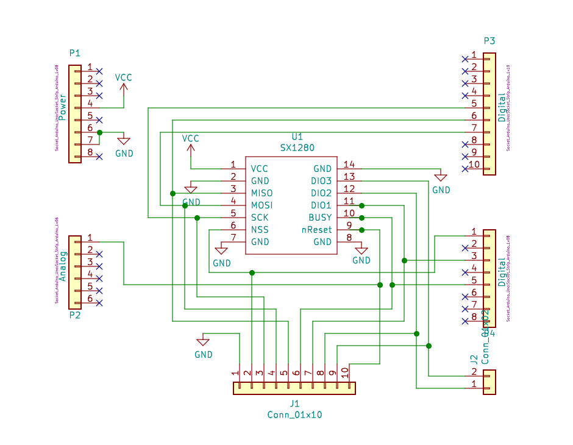
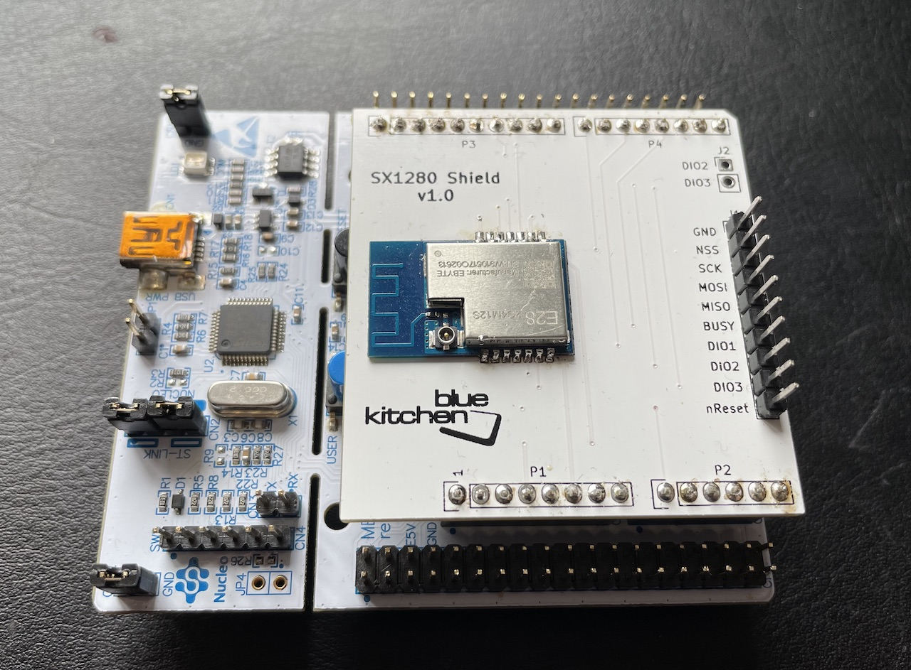

# SX1280 Breakout Board in Arduino Form-Factor

This is a breakout board for the SX1280 in Arduino form-factor to use with e.g. STM32 Nucleo Dev Boards or similar. It uses the [E28-2G4M12S module from EBYTE](https://www.ebyte.com/en/new-view-info.aspx?id=297), which is readily available from AliExpress or Banggod. 

## Motivation

The official SX1280 shield (SX1280RF1ZHP) from the Semtech's [SX1280DVK1ZHP](https://www.semtech.com/products/wireless-rf/24-ghz-transceivers/sx1280dvk1zhp) or [SX1280ED1ZHP](https://www.semtech.com/products/wireless-rf/lora-transceivers/sx1280ed1zhp) development kits have resistors in the SPI lines, which limit the SPI speed to about 5 Mhz. 

While SPI speed is not relevant for LoRa operations, implementing Bluetooth Low Energy requires to transfer data packets to/from the SX1280 quickly, which is easier to achieve with the max SPI speed of 18 Mhz. This breakout board was created to avoid replacing the resistors with 0 Ohm ones on the official shield and to allow the full 18 Mhz SPI speed.

## Usage

Signal | Arduino | Debug connector
-------|---------|----------------
3V3    |  3V3    | 
GND    |  GND    |   1
NSS    |  D7     |   2
SCK    |  SCK    |   3
MOSI   |  MOSI   |   4
MISO   |  MISO   |   5
BUSY   |  D3     |   6
DIO1   |  D5     |   7
DIO2   |         |   8
DIO3   |         |   9
nReset |  A0     |  10

All signals are provided at the J1 debug connector to hook up a logic analyzer.

The SX1280 can map various IRQ requests on the DIO1-3 pins. DIO1 is pre-assigned in this shield, while the DIO2 and DIO3 can be connected via jumper J2 to other GPIO pins if needed. 

Please note: The SX1280 is not 5V tolerant.

## References
- [SX1280 Product Page](https://www.semtech.com/products/wireless-rf/24-ghz-transceivers/sx1280)
- [SX1280 Datahsheet](https://semtech.my.salesforce.com/sfc/p/E0000000JelG/a/2R000000HoCW/8EVYKPLcthcKCB_cKzApAc6Xf6tAHtn9.UKcOh7SNmg)
- [28-2G4M12S Datasheet](https://www.ebyte.com/en/downpdf.aspx?id=286)

